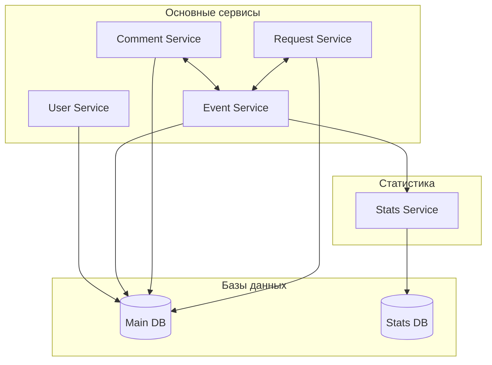
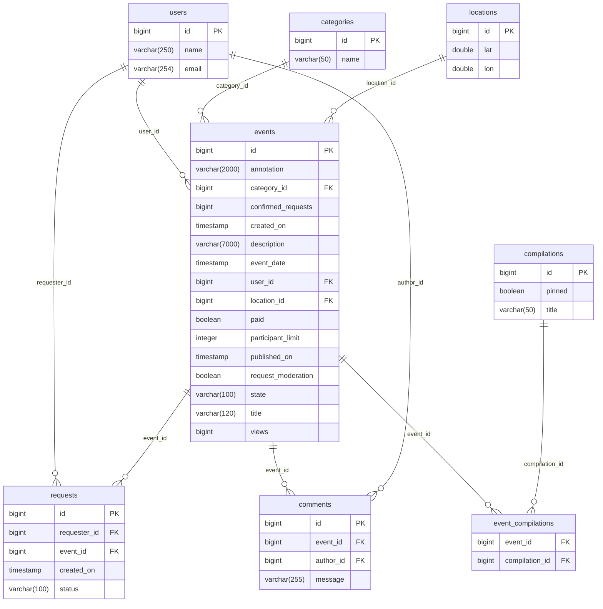
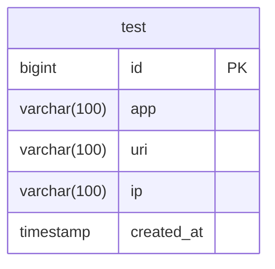

# java-explore-with-me

## Архитектура системы

## Main DB structure

## Stats DB structure

## API Спецификация

Подробная спецификация API доступна в формате OpenAPI 3.0:

### Полная спецификация API
Подробная спецификация в формате OpenAPI доступна в файле:
- [Основной сервис](/https://petstore.swagger.io/?url=https://raw.githubusercontent.com/kpak292/java-plus-graduation/main/ewm-main-service-spec.json)
- [Сервис статистики](/https://petstore.swagger.io/?url=https://raw.githubusercontent.com/kpak292/java-plus-graduation/main/ewm-stats-service-spec.json)
