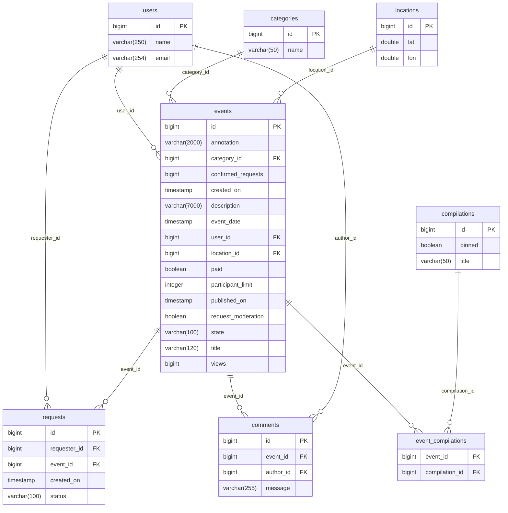
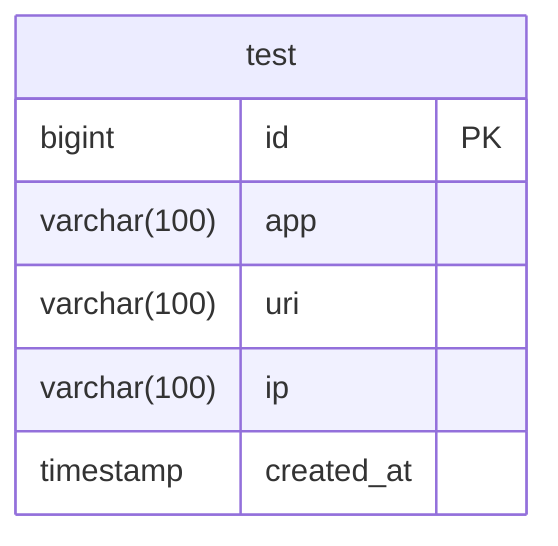

# java-explore-with-me

## Архитектура системы

subgraph Main Service
EС[Event Controller]
ES[Event Service]
ER[Event Repository]
EС --> ES
ES --> ER
end

subgraph Stats Service
SC[Stats Controller]
SS[Stats Service]
SR[Stats Repository]
SC --> SS
SS --> SR
end

subgraph Comment Service
CC[Comment Controller]
CS[Comment Service]
CR[Comment Repository]
CC --> CS
CS --> CR
end

## Main DB structure

## Stats DB structure

Development agreements:

1) Mappers generated by MapStruct
2) Link ONE Service to Many Repositories
3) All Common contants located in stats-service/stats-common/src/main/java/ru/practicum/Contants.java
4) Stats DTO located in stats-service/stats-common/src/main/java/ru/practicum
5) Tests should be implemented JsonTest, ControllerTest, ServiceTest, IntegrationTest (On Queries)